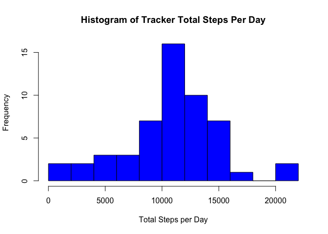
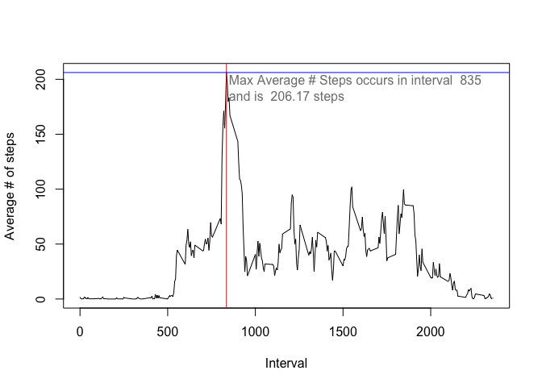

Analysis of Fitness Tracker Data
================================

###Prepared by Skamanrev 10 Feb 2015

###Summary
In this analysis data a from a fitness tracker is analyzed over a period of 61 days

Only 53 of the days contain valid tracker data. 8 Days do not

Initially the analysis will investigate the  data ignoring the missing. 
In this phase the fllowing will be investiagte

1 The mean and median total number of steps per day  
2 The average daily activity pattern (averaged over all days)

In the Second phase data pints will be imputed for the missing data and the steps above will 
be recomputed to see what effect the imputed data has on 

1 the mean and median  
2 the total number of steps

Finally uing the imputed data the diffences between weekend and weekday activity will be analyzed 

###Fetch and load Tracker Data

```r
working <- tempfile()
##setInternet2(TRUE) #This is required in knitr to make download work on Windows ->source stackoverflow
##download.file("https://d396qusza40orc.cloudfront.net/repdata%2Fdata%2Factivity.zip",working)
download.file("https://d396qusza40orc.cloudfront.net/repdata%2Fdata%2Factivity.zip",working,method="curl") ##This for macs
myactiv <- read.csv(unz(working, "activity.csv"))
unlink(working)
```
### What is mean total number of steps taken per day?

```r
library(plyr)
daysum<-ddply(myactiv,.(date),summarize,totstep=sum(steps)) #calc number or steps per day
```
####Plot Distribution of Total number of steps taken per day

```r
hist(daysum$totstep,10,col="blue",xlab="Total Steps per Day",main="Histogram of Tracker Total Steps Per Day")
```

 

####Median and mean number of steps per day

```r
raw_med<-median(daysum$totstep,na.rm=T)
raw_mean<-mean(daysum$totstep,na.rm=T)
raw_med
```

```
## [1] 10765
```

```r
raw_mean
```

```
## [1] 10766.19
```


### What is the average daily activity pattern?  

```r
#calculate the mean number of steps per interval across all days
meanint<-ddply(myactiv,.(interval),summarise,meanstep=mean(steps,na.rm=T)) 
plot(meanint$interval,meanint$meanstep,type="l",xlab="Interval",ylab="Average # of steps")
#CALCULATE interval with max ave value and mark on plot
maxint<-meanint[meanint$meanstep==max(meanint$meanstep),1]
maxval<-meanint[meanint$meanstep==max(meanint$meanstep),2]
abline(v=maxint,col="red")
abline(h=maxval,col="blue")
text(maxint+15,maxval-25, paste("Max Average # Steps occurs in interval ",maxint," \nand is ", 
                                round(maxval,2),"steps"), col = "gray50", adj = c(0, 0))
```

 

####The Interval with the highest average number of steps is

```r
maxint
```

```
## [1] 835
```
## Imputing missing values


## Are there differences in activity patterns between weekdays and weekends?
